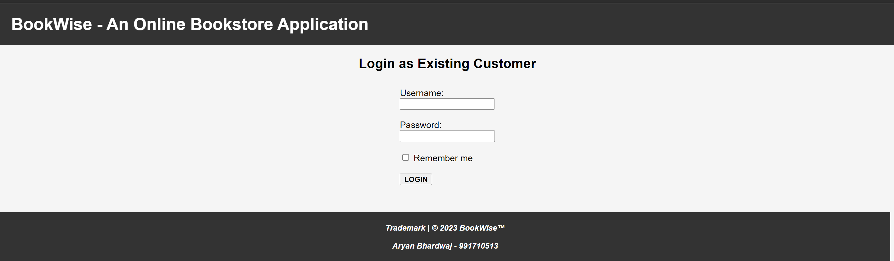

# BookWise - An Online Bookstore Application

BookWise is an online bookstore application developed as a Java Spring Boot project. It allows users to browse books, add them to their cart, and place orders. The application provides a user-friendly interface for managing book purchases, making it convenient for book lovers to explore and buy their favourite titles. With BookWise, users can discover new books, track their orders, and enjoy a seamless shopping experience from the comfort of their homes.

## Features

- User registration and login
- Browse and search for books
- Add books to the cart
- Place orders
- View order history

## Technologies Used

- Java
- Spring Boot
- Thymeleaf
- MySQL
- HTML/CSS

## Setup

1. Clone the repository:

   ```bash
   git clone https://github.com/bhaaryan123/BookstoreAssignmentAryanBhardwaj.git

2. Create a MySQL database named *bookstore* and import the provided _bookdata.sql_ and *userdata.sql* files to populate the initial data.

3. Configure the MySQL connection in *application.properties*:

   spring.datasource.url=jdbc:mysql://localhost:3306/bookstore
   spring.datasource.username=your_username
   spring.datasource.password=your_password

4. *Run* the application:

   mvn spring-boot:run

5. Access the application at *http://localhost:8080*

## Usage

- Register as a new user or login with an existing account.
- Browse books and add them to your cart.
- View your cart and proceed to checkout to place an order.

## Screenshots
   
   <hr>
   
   <hr>
   
   <hr>
   
   <hr>
   

## Contributors

*Aryan Bhardwaj*


